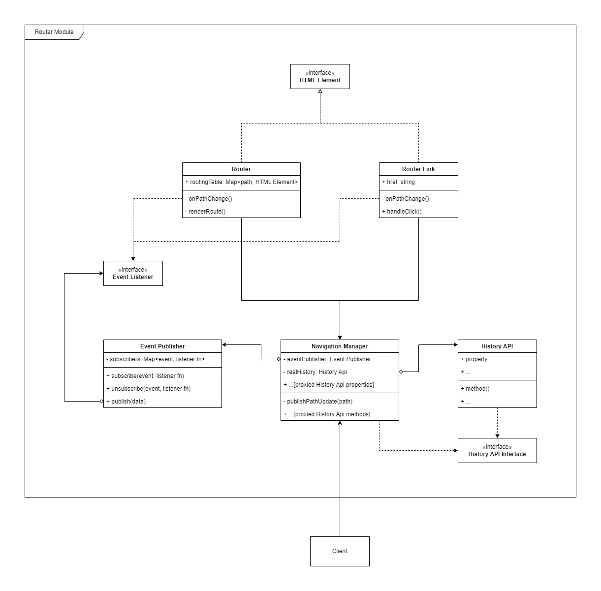
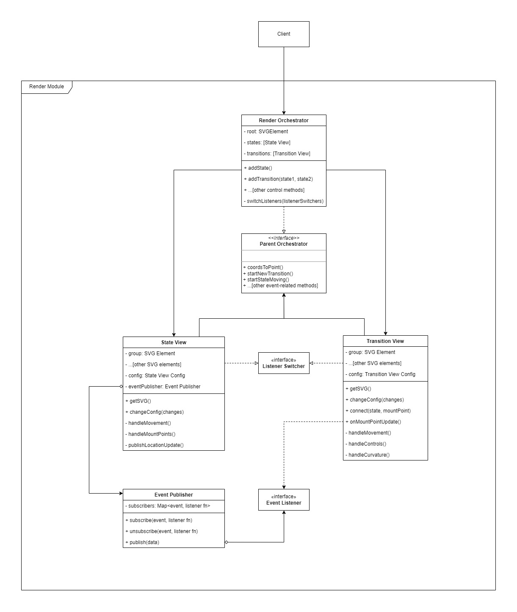

# Automaton Simulator

**WORK IN PROGRESS**

## Preview

[Simulator can be previewed here.](https://ushka1.github.io/automaton-simulator/)

## Description

An intuitive tool for constructing and testing state automata (DFA, NFA, e-NFA, PDA) created with pure TypeScript and WebComponents.

## Setup

1. Run `npm i` to install dependencies.
2. Run `npm run dev` to start the development server.

## Docs

### Router module

### Render module

